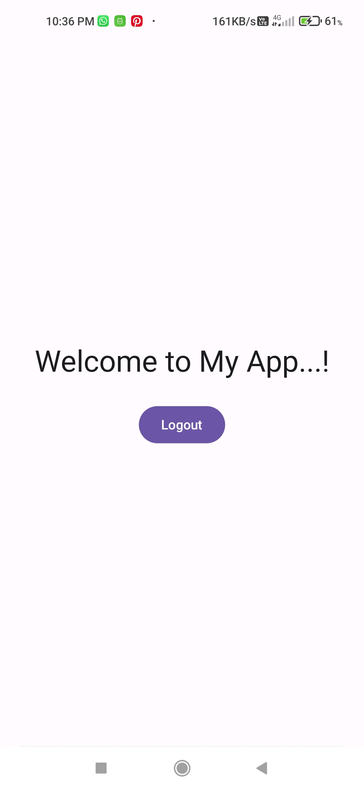

# Login/Register App

## Overview  
A complete **Login/Register Authentication App** built using **Jetpack Compose** with **Clean Architecture** principles. It integrates a **Node.js** backend powered by **MongoDBAtlas**, hosted securely on **Render**.

---

## Features
- **User Registration** with username and password.
- **Secure Login** system with proper error handling.
- Authentication logic using **ViewModel** and state flows.
- Backend APIs integrated with **MongoDB** for user data storage.
- Fully responsive and clean UI built using Jetpack Compose.
- Backend hosted on Render with a public API endpoint.

---

## 📸 Screenshots

### Login Screen


### Register Screen


### Success Screen


---

## Tech Stack

### Frontend (Android):
- **Jetpack Compose**: Modern UI toolkit for building native Android UIs.
- **Clean Architecture**:
  - **Presentation Layer**: Jetpack Compose UI + Hilt-based ViewModels.
  - **Domain Layer**: Repository interface for business logic abstraction.
  - **Data Layer**: Repository implementation using Retrofit API calls.

### Backend:
- **Node.js**: Lightweight and scalable backend server.
- **Express.js**: Web framework to define RESTful API endpoints.
- **MongoDB**: NoSQL database for storing user login credentials securely.

### Hosting:
- **Render**: Platform used to host the backend and provide a public-facing API endpoint accessible from the Android app.

---

## Setup Instructions

### Prerequisites
1. **Android Studio** installed.
2. **Node.js** and **npm** installed.
3. A **MongoDB** instance (via MongoDB Atlas or locally).
4. A **Render account** to host your backend.

---

### Backend Setup

1. Clone the backend repository:
   ```bash
   git clone https://github.com/omkardhenge/login_register_backend.git
   cd login_register_backend
   ```

2. Install Node.js dependencies:
   ```bash
   npm install
   ```

3. Create a `.env` file:
   ```env
   PORT=3000
   MONGO_URI=mongodb+srv://<username>:<password>@cluster.mongodb.net/<dbname>?retryWrites=true&w=majority
   ```

4. Start the backend server:
   ```bash
   npm start
   ```

5. Deploy backend to **Render**:
   - Connect this GitHub repo to Render.
   - Set the environment variables (`PORT`, `MONGO_URI`) in Render dashboard.
   - Deploy and copy the public API URL.

---

### Android Frontend Setup

1. Clone the Android project:
   ```bash
   git clone https://github.com/omkardhenge/LoginRegisterApp.git
   ```

2. Open the project in **Android Studio**.

3. In `gradle.properties` or `BuildConfig.BASE_URL`, set your Render URL:
   ```properties
   BASE_URL=https://your-render-url.onrender.com
   ```

4. Run the app on your Android emulator or device.

---

## API Endpoints

### Base URL:
```
https://your-render-url.onrender.com
```

### Endpoints:
- **POST /register** — Register a new user.
- **POST /login** — Authenticate a user with username and password.


